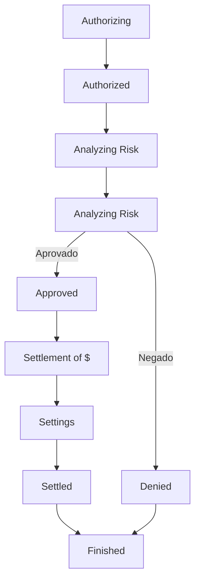

# Os diferentes métodos de pagamento da VTEX
Quando se trata de fazer compras, o meio de pagamento é uma escolha importante para o cliente. Existem diferentes maneiras que o consumidor pode pagar por um produto ou serviço. Na plataforma VTEX, os tipos de meios de pagamento disponíveis incluem:

-   Cartões de crédito
-   Cartões de débito
-   Dinheiro
-   Pagamentos personalizados
-   Pagamentos regionais como PIX ou boleto bancário

Os meios de pagamento podem variar de país para país, portanto é importante saber se os meios de pagamento processados pelo seu sistema são compatíveis com a plataforma VTEX antes de realizar uma integração. A escolha de um meio de pagamento apropriado pode fazer toda a diferença para o sucesso da compra, sendo fundamental considerar as opções disponíveis e que melhor combine com seu negócio.

Para que um meio de pagamento esteja disponível na loja online da VTEX, é preciso configurá-lo no módulo de Pagamentos. Nesse processo, são definidas as condições que o usuário deve seguir para realizar o pagamento no momento de finalizar a compra.

É importante ressaltar a diferença entre meios de pagamento e condições de pagamentos. Os **meios de pagamento** são as diferentes formas que um cliente pode utilizar para efetuar o pagamento de um produto ou serviço, já as **condições de pagamento** são as regras que o cliente deve seguir para realizar o pagamento utilizando o meio escolhido, como o número de parcelas, a taxa de juros, o desconto à vista, entre outras opções que podem ser configuradas no módulo de Pagamentos da plataforma VTEX. Enquanto os meios de pagamento se referem às diferentes formas de pagamento disponíveis, as condições de pagamento são as regras e opções específicas para cada meio de pagamento utilizado.

O meio em que o dinheiro se movimento durante uma compra de um produto ou serviço é chamado de transação.

As transações realizadas pelo módulo de pagamentos da plataforma VTEX passam por diversos status até a finalização da transação.

Veja abaixo como ocorre a transição entre os status:



1.  Authorizing: Indica que se iniciou o processo de envio de informações para um adquirente ou para gateway.
2.  Authorized: Os dados são enviados para o banco emissor que responde se a transação é autorizada ou negada.
3.  Analyzing Risk: O sistema antifraude analisará o risco da transação.
4.  Analyzing Risk: O sistema antifraude aprovará ou ir negar a transação.
5.  Approved: A transação passou por todas as verificações e foi autorizada.
6.  Settlement of $: Indica que o processo de liquidação será iniciado.
7.  Settings: Inicia tentativa de liquidação do valor
8.  Settled: Indica que o valor foi liquidado com sucesso
9.  Finished: A Nota fiscal com valor do pagamento é emitida.

Para exemplificar o processo de pagamento segue abaixo o fluxo de um pagamento por cartão de crédito:

 ```mermaid
graph TD;
    A[Loja Online] --> |Dados do Pagamento| B[Gateway de Pagamento];
    B --> C[Adquirente];
    C --> D[Bandeira];
    D --> E[Banco Emissor];
    D --> C;
    C --> B;
    B --> |Autorizado ou Negado| A;
    E --> D;
```

1.  O cliente escolhe o meio de pagamento por cartão de crédito para realizar o pagamento
2.  O gateway de pagamento recebe os dados do pagamento
3.  O gateway repassa as informações de pagamento para o adquirente
4.  O adquirente envia os dados de pagamento para a Bandeira
5.  A Bandeira envia os dados de pagamento para o Banco Emissor

O método de pagamento tem um grande impacto na loja online, pois é uma escolha importante para o cliente, a escolha adequada e a configuração correta das condições de pagamento são fundamentais para garantir uma boa experiência de compra ao cliente e aumentar as chances de conversão de vendas na loja online.
